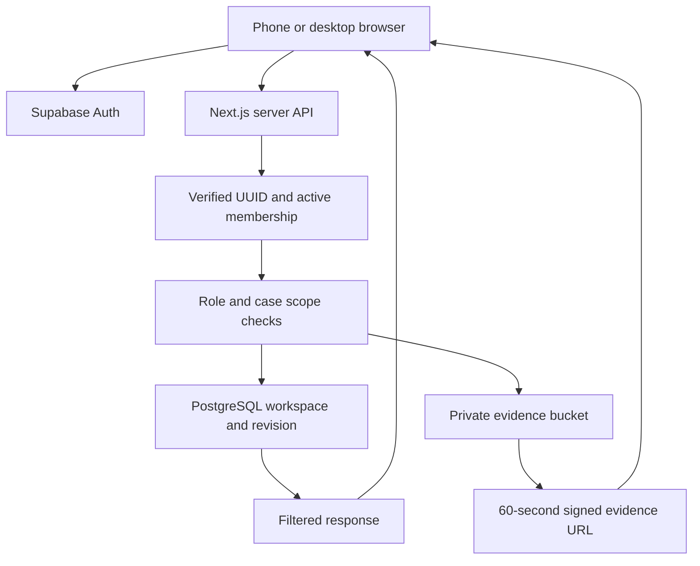
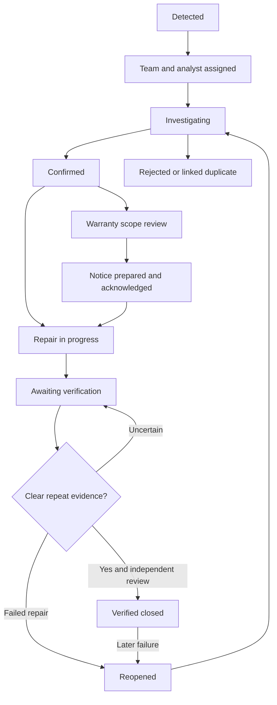
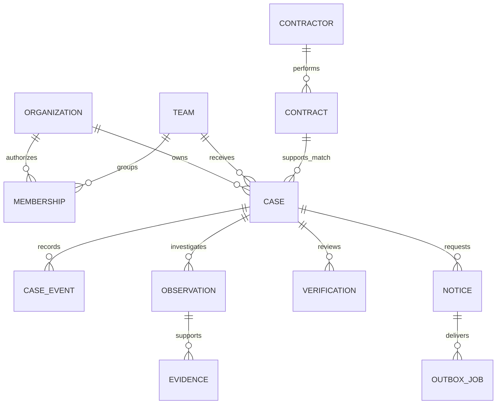

# PaveLedger architecture diagrams

## Implemented request boundary

The server secret stays in the server environment. Direct browser access to the workspace table and evidence bucket is not granted.

## Investigation decisions

A hold records the preceding stage and resumes that same stage. Notice preparation is internal in this release; outgoing delivery is a future integration.

## Target relational model — design, not deployed tables

Use organization-scoped keys and foreign keys throughout. Audit/event and notice-outbox writes must commit with their corresponding state change. Spatial road-segment and contract-scope data require PostGIS and authoritative GIS/contract sources.
